# DANSM

**DANSM: Distance-Aware Noise-Sample Matching**

Code for ICLR 2025 paper: [Easing Training Process of Rectified Flow Models Via Lengthening Inter-Path Distance](https://openreview.net/forum?id=RaR3ETzyKp "ICLR 2025")

This paper aims to improve the training efficiency and reduce the computational cost of 
[Rectified Flow Models (RFM)](https://github.com/ermongroup/ddim), which are employed in 
[Stable Diffusion 3 (SD)](https://stability.ai/news/stable-diffusion-3). 
While the theoretical derivations are based on RFM, the findings and conclusions 
are also applicable to [Diffusion Models (DM)](https://github.com/ermongroup/ddim). 
Experimental results demonstrate that DANSM accelerates training by 30% to 40% 
without compromising generation quality.

## Theoretical foundations
The DANSM method is derived from two theoretical foundations.

### Foundation 1: consistent model reproducibility
It is well-studied that when training on the same dataset, 
different diffusion methods (RFM, DM) using different architectures result in a similar mapping. 
In other words, given the same input noise, the trained models generate similar resultant samples. 

The figures below show images generated by well-trained 
[RFM (Liu et al., 2022)](https://github.com/gnobitab/RectifiedFlow) 
and [DM (Ermongroup, 2021)](https://github.com/ermongroup/ddim). 
Images in the same group are derived from the same noise.
<table>
  <tbody>
    <tr>
      <td>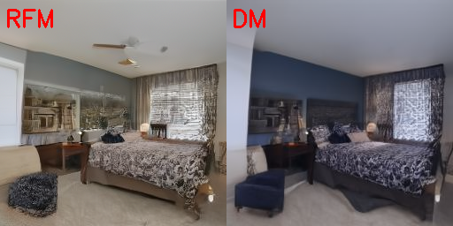</td>
      <td></td>
      <td>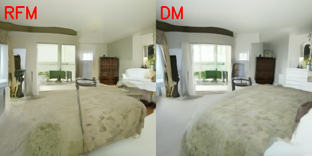</td>
      <td>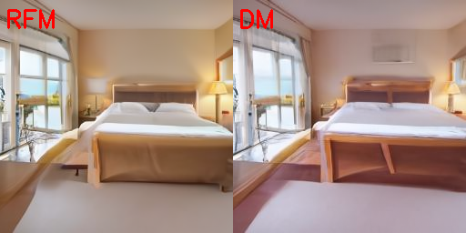</td>
    </tr>
    <tr>
      <td>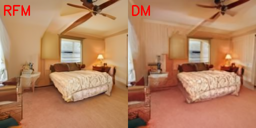</td>
      <td>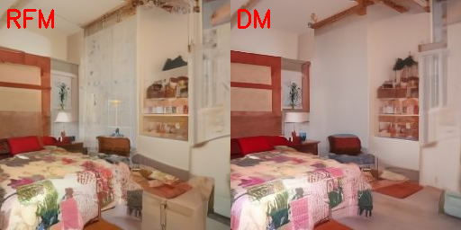</td>
      <td>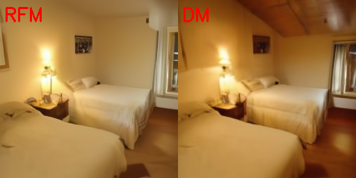</td>
      <td>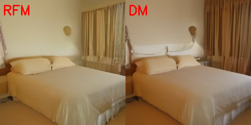</td>
    </tr>
  </tbody>
</table>

### Foundation 2: Preferable noises are nearer to sample
Recent research pinpoints that different diffusion methods and architectures 
trained on the same dataset produce similar results for the same input noise. 
This property suggests that they have some ``preferable noises`` for a given sample. 
By visualizing the noise-sample pairs of rectified flow models and stable diffusion
models in two-dimensional spaces, we observe that the ``preferable paths``, connecting
preferable noises to the corresponding samples, are much well organized with
significant fewer crossings comparing with the ``random paths``, connecting random
noises to training samples.

The figures below show the visualization of samples and noises using 
[t-SNE (Van der Maaten & Hinton, 2008)](http://www.cs.toronto.edu/~hinton/absps/tsnefinal.pdf). 
Each sample and its corresponding noise are connected with dashed line. 
The lines in the top row are messy with multiple intersections, 
while the bottom row illustrates well-organized lines.
<table>
  <tbody>
    <tr>
      <td>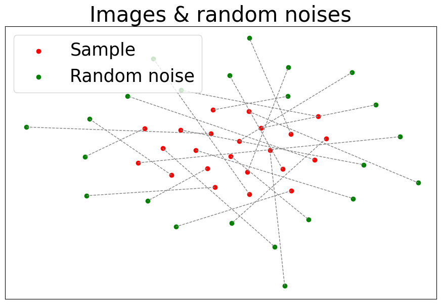</td>
      <td>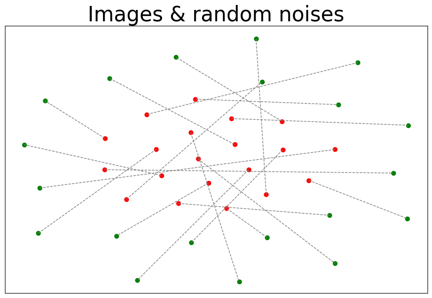</td>
      <td>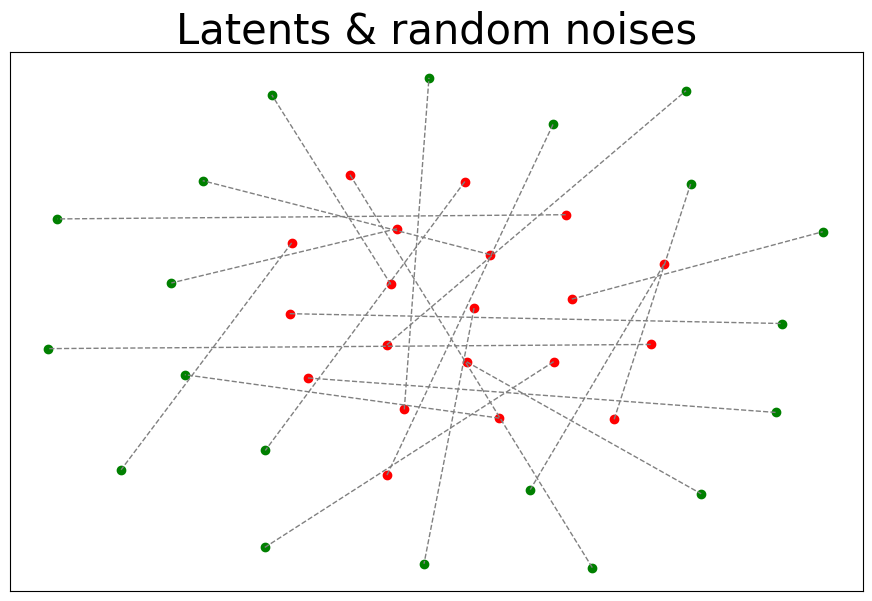</td>
      <td>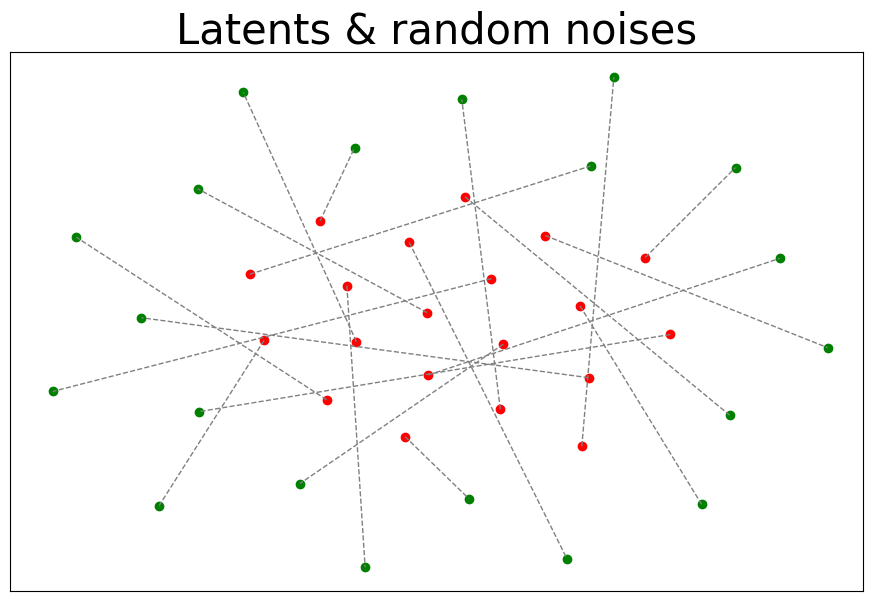</td>
    </tr>
    <tr>
      <td>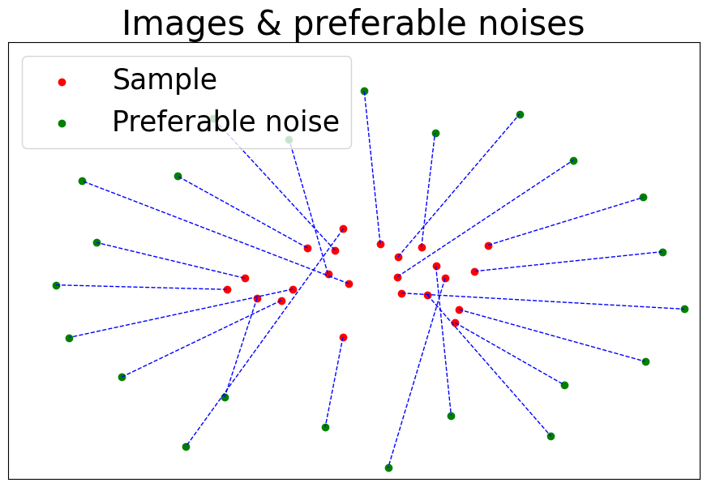</td>
      <td>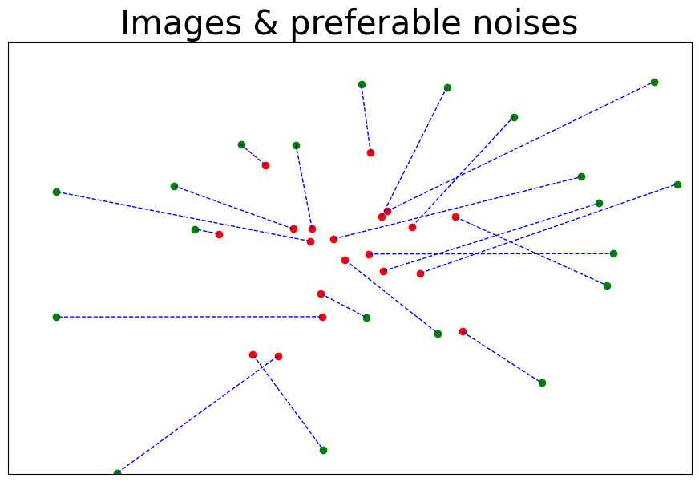</td>
      <td>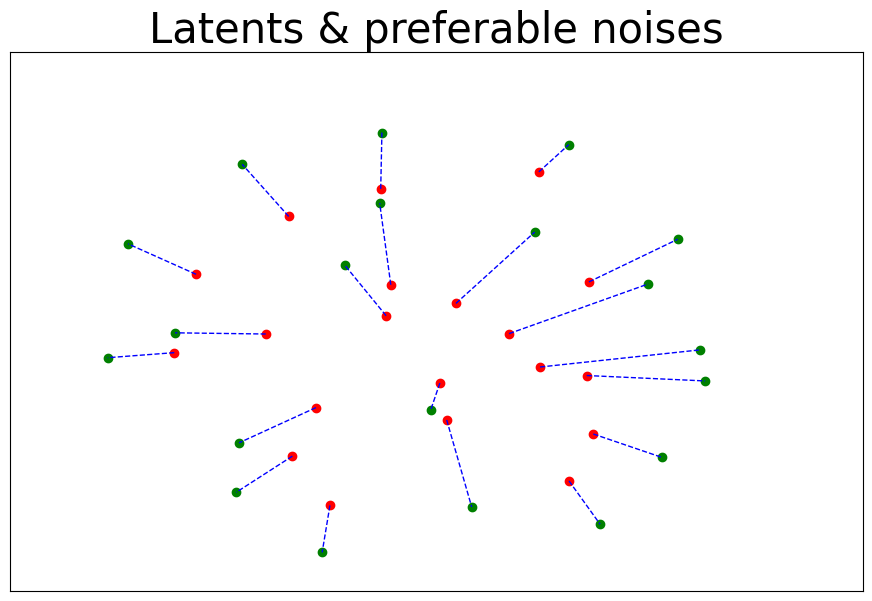</td>
      <td>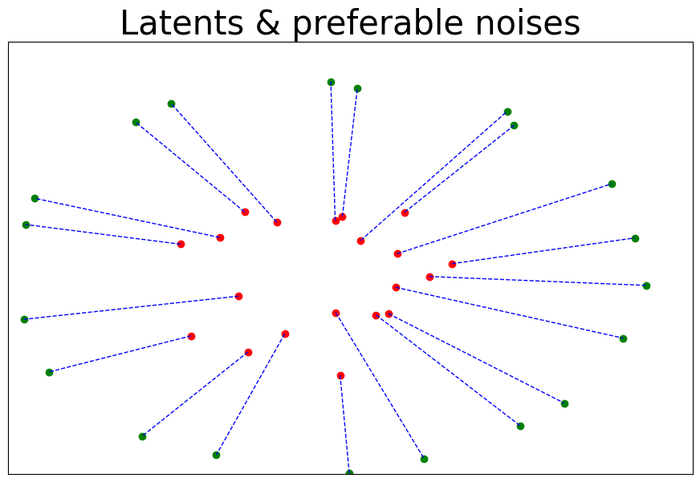</td>
    </tr>
    <tr style="font-weight: bold; text-align: center">
      <td>CIFAR-10 images</td>
      <td>Bedroom images</td>
      <td>Latents of Bedroom</td>
      <td>Latents of SD</td>
    </tr>
  </tbody>
</table>

## Theoretical deduction and proof
Please read the [main paper](https://openreview.net/forum?id=RaR3ETzyKp) 
for theoretical deduction and proof.

Here a key concept in DANSM is the match-size (``ms``), which is a positive integer 
defining the size of the sample set and noise set in the training process. 
In each iteration of the training process in RFM or DM, 
DANSM will adjust the order of the noises to match the samples, and ms defines the set size. 
It is worth noting that, ms is not batch-size.

## Qualitative comparison
Visual comparison of images generated by RFM models on latent of Bedroom.
The models are trained on the same latent space using different methods: 
vanilla RFM, DANSM with match-size 100, and DANSM with match-size 10K. 
Different rows are generated by different sampling steps: 3 steps, 
4 steps, 5 steps, and 10 steps. 
<table>
<tbody>
  <tr>
    <td style="font-weight: bold; text-align: center">3 steps</td>
    <td>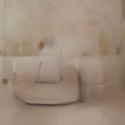</td>
    <td>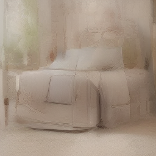</td>
    <td>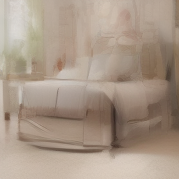</td>
  </tr>
  <tr>
    <td style="font-weight: bold;">4 steps</td>
    <td>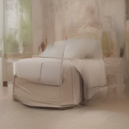</td>
    <td>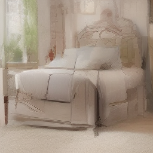</td>
    <td></td>
  </tr>
  <tr>
    <td style="font-weight: bold;">5 steps</td>
    <td>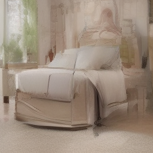</td>
    <td>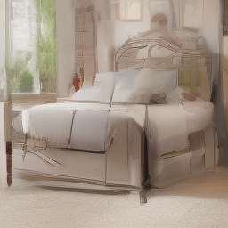</td>
    <td></td>
  </tr>
  <tr>
    <td style="font-weight: bold;">10 steps</td>
    <td>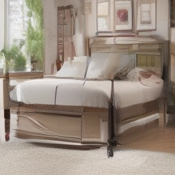</td>
    <td></td>
    <td></td>
  </tr>
  <tr style="font-weight: bold; text-align: center">
    <td></td>
    <td>Vanilla RFM</td>
    <td>RFM with ms=100</td>
    <td>RFM with ms=10K</td>
  </tr>
</tbody>
</table>


## Citation
If you use the code or paper, please cite us:
```
@inproceedings{
    shifeng2025dansm,
    title={Easing Training Process of Rectified Flow Models Via Lengthening Inter-Path Distance},
    author={Xu Shifeng and Yanzhu Liu and Adams Wai-Kin Kong},
    booktitle={The Thirteenth International Conference on Learning Representations},
    year={2025},
    url={https://openreview.net/forum?id=RaR3ETzyKp}
}
```

## Thanks
Some portions of this codebase are built upon:

[Rectified Flow Model from gnobitab](https://github.com/gnobitab/RectifiedFlow)

[DDIM from ermongroup](https://github.com/ermongroup/ddim)

[Stable Diffusion](https://github.com/Stability-AI/stablediffusion)