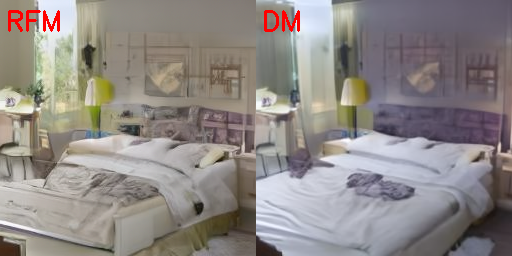

# DANSM

**DANSM: Distance-Aware Noise-Sample Matching**

Code for ICLR 2025 spotlight paper: [Easing Training Process of Rectified Flow Models Via Lengthening Inter-Path Distance](https://openreview.net/forum?id=RaR3ETzyKp "ICLR 2025")

This paper aims to improve the training efficiency and reduce the computational cost of 
[Rectified Flow Models (RFM)](https://github.com/ermongroup/ddim), which are employed in 
[Stable Diffusion 3 (SD)](https://stability.ai/news/stable-diffusion-3). 
While the theoretical derivations are based on RFM, the findings and conclusions 
are also applicable to [Diffusion Models (DM)](https://github.com/ermongroup/ddim). 
Experimental results demonstrate that DANSM accelerates training by 30% to 40% 
without compromising generation quality.

## Theoretical foundations
The DANSM method is derived from two theoretical foundations.

### Foundation 1: consistent model reproducibility
It is well established that when trained on the same dataset, 
different diffusion-based methods (e.g., RFM, DM) with varying architectures 
tend to learn a similar mapping. 
In other words, given the same input noise, the well-trained models produce 
similar generated samples.

The figures below show images generated by well-trained 
[RFM (Liu et al., 2022)](https://github.com/gnobitab/RectifiedFlow) 
and [DM (Ermongroup, 2021)](https://github.com/ermongroup/ddim). 
Images in the same group are derived from the same noise.
<table>
  <tbody>
    <tr>
      <td></td>
      <td></td>
      <td></td>
      <td></td>
    </tr>
    <tr>
      <td></td>
      <td></td>
      <td></td>
      <td></td>
    </tr>
  </tbody>
</table>

### Foundation 2: Preferable noises are nearer to sample
Recent research pinpoints that different diffusion methods and architectures 
trained on the same dataset produce similar results for the same input noise. 
This property suggests that they have some ``preferable noises`` for a given sample. 
By visualizing the noise-sample pairs of rectified flow models and stable diffusion
models in two-dimensional spaces, we observe that the ``preferable paths``, connecting
preferable noises to the corresponding samples, are much well organized with
significant fewer crossings comparing with the ``random paths``, connecting random
noises to training samples.

The figures below show the visualization of samples and noises using 
[t-SNE (Van der Maaten & Hinton, 2008)](http://www.cs.toronto.edu/~hinton/absps/tsnefinal.pdf). 
Each sample and its corresponding noise are connected with dashed line. 
The lines in the top row are messy with multiple intersections, 
while the bottom row illustrates well-organized lines.
<table>
  <tbody>
    <tr>
      <td></td>
      <td></td>
      <td></td>
      <td></td>
    </tr>
    <tr>
      <td></td>
      <td></td>
      <td></td>
      <td></td>
    </tr>
    <tr align="center">
      <td>CIFAR-10 images</td>
      <td>Bedroom images</td>
      <td>Latents of Bedroom</td>
      <td>Latents of SD</td>
    </tr>
  </tbody>
</table>

## Theoretical deduction and proof
For theoretical deductions and proofs, please refer to the 
[main paper](https://openreview.net/forum?id=RaR3ETzyKp).  

A key concept in DANSM is the match-size (`ms`), a positive integer 
that determines the size of the noise-sample matching operation during training.  
It is important to note that `ms` is different with the batch size.
In each training iteration of RFM or DM, DANSM reorders the noise to align with 
the corresponding samples, with `ms` defining the set size.

Let's take $ms=10$ as an example. DANSM selects 10 samples, denoted as $S_{10}$, 
and generates 10 random Gaussian noises, denoted as $N_{10}$. 
It then reorders the noises in $N_{10}$ to ensure that each noise-sample pair 
has a shorter path length. 
After this alignment, the noise-sample pairs are fed into the training process for 
loss calculation, gradient propagation, and parameter updates.

## DANSM algorithm implementation
The implementation of the DANSM method can be found in the file 
[match_scope_manager.py](./models/match_scope_manager.py). 
It handles the noise-sample matching based on ``ms``. 
Although it is a simple class, it encapsulates the core logic of DANSM.

## Run the code
To run the code, the entry point is in the `main_pytorch.py` file.  

The example below demonstrates training the latent representations of 
[LSUN Bedroom images](https://github.com/fyu/lsun). 
This requires downloading the Bedroom image dataset and encoding the images into 
latent space using a Stable Diffusion (SD) encoder. 
The relevant SD checkpoint can be found at 
[SD v2-1_512-ema-pruned.ckpt](https://huggingface.co/stabilityai/stable-diffusion-2-1-base/blob/main/v2-1_512-ema-pruned.ckpt).

```shell
#!/bin/bash

set -e
gpu_ids="1"
ms_size=10000

# The training data. It is the latent of Bedroom images.
# Before training, the Bedroom images should be encoded into latent by SD.
data_dir="../download_dataset/lsun/bedroom_train_ltt"

# save checkpoint
save_ckpt_path="./ckpt_RFM_bedroom_latent_MS$ms_size.pth"

# Stable Diffusion pretrained model checkpoint
sd_ckpt_path="../checkpoints/v2-1_512-ema-pruned.ckpt"

# sampling steps
s_steps_arr="5"

# for calculating FID 
fid_input1="../download_dataset/lsun/bedroom_train"


python -u ./main_pytorch.py                 \
    --todo               train_latent_ms    \
    --model              rfm                \
    --config             latent_bedroom     \
    --seed               20241115           \
    --data_dir           $data_dir          \
    --sd_ckpt_path       $sd_ckpt_path      \
    --H                  256                \
    --W                  256                \
    --C                  4                  \
    --f                  8                  \
    --ema_rate           0.9999             \
    --n_epochs           500                \
    --lr                 0.0001             \
    --batch_size         250                \
    --ms_size            $ms_size           \
    --log_interval       20                 \
    --save_ckpt_path     $save_ckpt_path    \
    --save_ckpt_eval     False              \
    --save_ckpt_interval 20                 \
    --sample_batch_size  50                 \
    --sample_count       10000              \
    --sample_output_dir  ./generated        \
    --sample_steps_arr   $s_steps_arr       \
    --fid_input1         $fid_input1        \
    --gpu_ids            $gpu_ids
```

## Qualitative comparison
Visual comparison of images generated by RFM models on latent of Bedroom.
The models are trained on the same latent space using different methods: 
vanilla RFM, DANSM with match-size 100, and DANSM with match-size 10K. 
Different rows are generated by different sampling steps: 
3 steps, 4 steps, 5 steps, and 10 steps. 
<table>
<tbody>
  <tr>
    <td>3 steps</td>
    <td></td>
    <td></td>
    <td></td>
  </tr>
  <tr>
    <td>4 steps</td>
    <td></td>
    <td></td>
    <td></td>
  </tr>
  <tr>
    <td>5 steps</td>
    <td></td>
    <td></td>
    <td></td>
  </tr>
  <tr>
    <td>10 steps</td>
    <td></td>
    <td></td>
    <td></td>
  </tr>
  <tr align="center">
    <td></td>
    <td>Vanilla RFM</td>
    <td>RFM with ms=100</td>
    <td>RFM with ms=10K</td>
  </tr>
</tbody>
</table>

## Citation
If you use the code or paper, please cite us:
```
@inproceedings{
    shifeng2025dansm,
    title={Easing Training Process of Rectified Flow Models Via Lengthening Inter-Path Distance},
    author={Xu Shifeng and Yanzhu Liu and Adams Wai-Kin Kong},
    booktitle={The Thirteenth International Conference on Learning Representations},
    year={2025},
    url={https://openreview.net/forum?id=RaR3ETzyKp}
}
```

## Thanks
Some portions of this codebase are built upon:

[Rectified Flow Model from gnobitab](https://github.com/gnobitab/RectifiedFlow)

[DDIM from ermongroup](https://github.com/ermongroup/ddim)

[Stable Diffusion](https://github.com/Stability-AI/stablediffusion)
